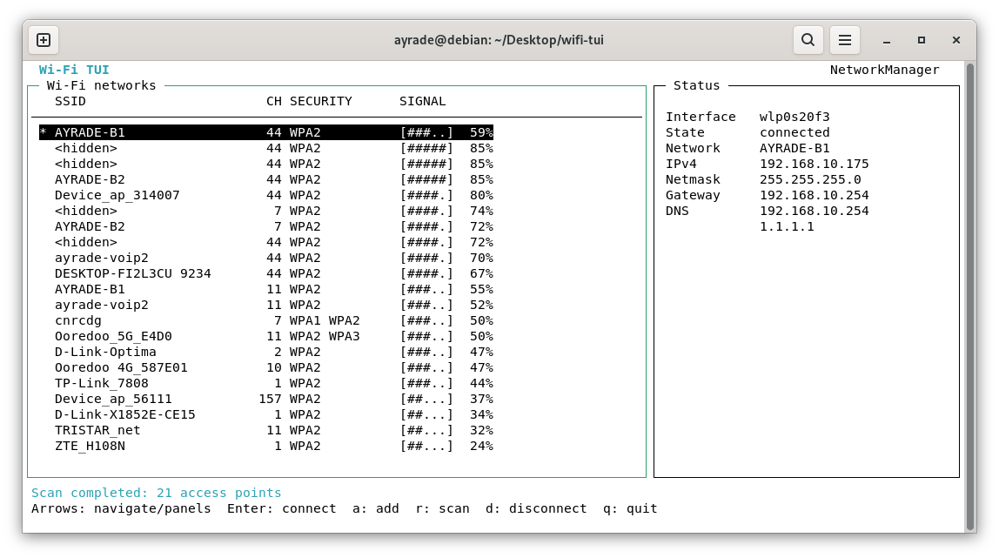

# wifi-tui - By HIRECHE BAGHDAD BELKHEIR





An interactive ncurses Wi-Fi controller for Debian 13 systems managed by
NetworkManager. It scans nearby access points, connects to open or secured
networks, supports hidden/custom SSIDs, and displays the current IPv4 address,
netmask, gateway, and DNS servers.

## Requirements

```sh
sudo apt install build-essential libncurses-dev network-manager
```

NetworkManager must manage the Wi-Fi device. Verify this with:

```sh
nmcli device status
```

## Build and run

```sh
make
./wifi-tui
```

Run the parser/UI smoke test with `make test`. It uses a fake `nmcli` and does
not touch the machine's network configuration.

Installation is optional:

```sh
sudo make install
wifi-tui
```

The program normally runs as your desktop user. NetworkManager/Polkit may ask
for authorization depending on the system policy; do not run the TUI with
`sudo` solely to connect to Wi-Fi.

## Controls

| Key | Action |
| --- | --- |
| `Up` / `Down` | Select a network |
| `Left` / `Right` | Focus the network or status panel |
| `Enter` | Connect to the selected network |
| `a` | Add/connect to a custom or hidden SSID |
| `r` | Rescan nearby networks |
| `d` | Disconnect the Wi-Fi interface |
| `Home` / `End`, `PgUp` / `PgDn` | Move through a long list |
| `q` | Quit |

For previously saved profiles, NetworkManager reuses stored credentials. For a
new secured network, the TUI requests a password after the first activation
attempt. WPA Enterprise/802.1X profiles should be configured first with
NetworkManager (for example with `nmtui` or `nm-connection-editor`); they can
then be activated through the normal NetworkManager tools.
